<div align="center">

# VEXIS

**Hardware monitoring, fan control and RGB — in one Windows app.**

[](https://github.com/Vlottiz/Vexis-PC-monitor-and-controll/releases/latest)
[](https://github.com/Vlottiz/Vexis-PC-monitor-and-controll/releases)
[](#requirements)
[](LICENSE.txt)
[](https://buymeacoffee.com/reyobu)

### [⬇ Download the latest version](https://github.com/Vlottiz/Vexis-PC-monitor-and-controll/releases/latest)

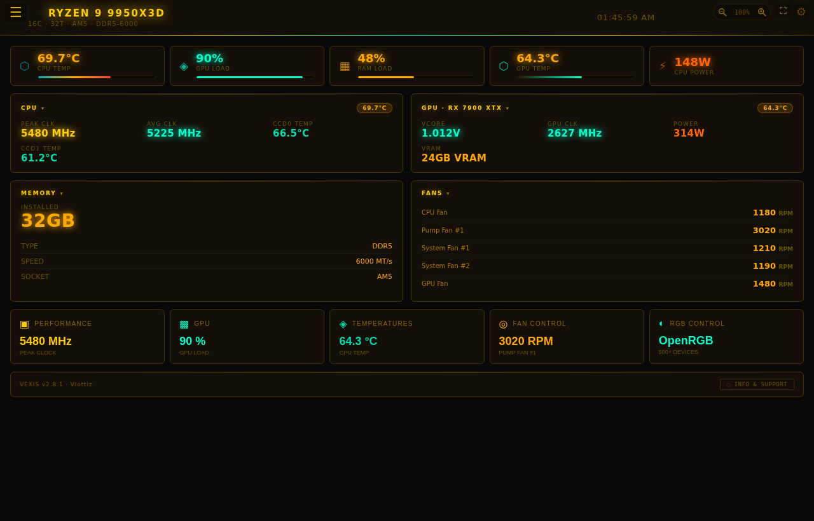

</div>

---

## Why Vexis?

Most PCs end up with three or four vendor apps just to see temperatures, set fan curves and change the RGB. Vexis puts it all in one lightweight app:

- **Everything live** — per-core clocks and threads, temperatures, GPU, memory, fans and processes
- **Real control** — fan curves for motherboard *and* GPU fans, RGB for 500+ devices through OpenRGB
- **Works with Windows security on** — uses the signed PawnIO driver; Memory Integrity and VBS stay enabled
- **Yours to style** — 8 themes, full colour editing, text scaling, pop-out windows for a second monitor
- **Keeps itself current** — one-click updates from inside the app

---

## Screenshots

> Screenshots show the real interface with sample readings.

| Performance | Thread Viewer |
|---|---|
| 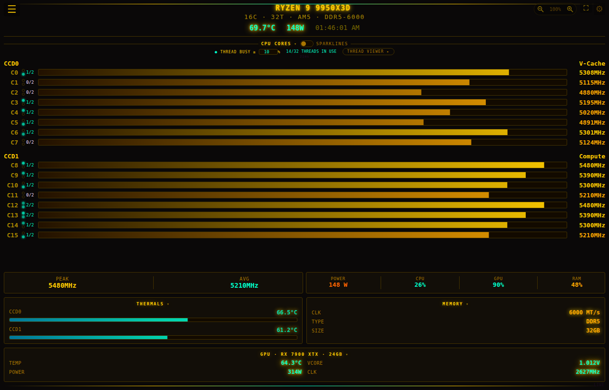 | 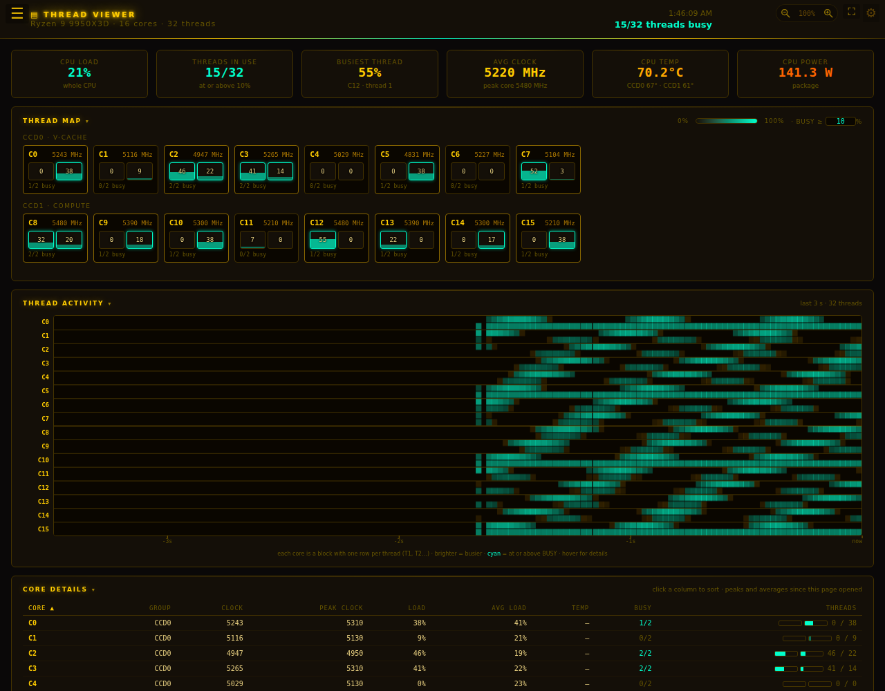 |
| **Per-core clocks with threads in use, CCD groups, thermals** | **Every hardware thread: live map, activity timeline, core table** |

| GPU | Processes |
|---|---|
| 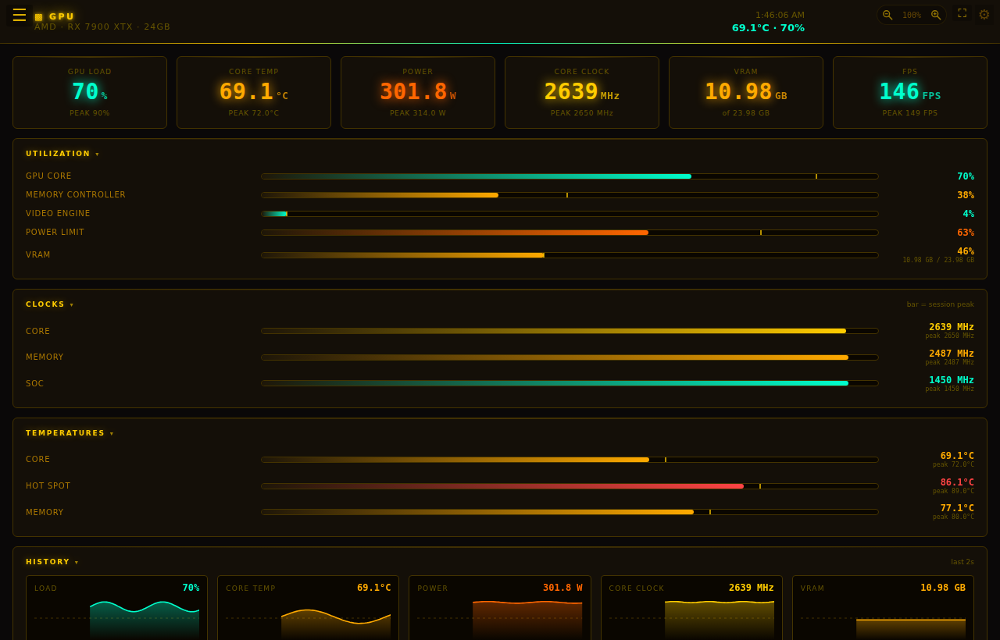 | 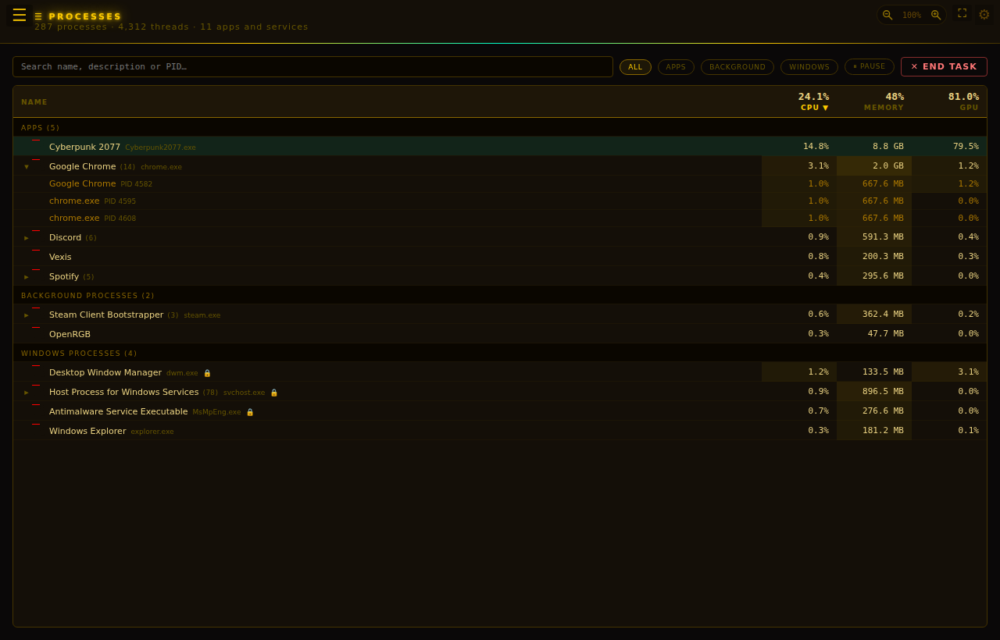 |
| **Load, clocks, hot spot and VRAM temps, power, FPS, history** | **Task-Manager-style list with CPU, memory and GPU per app** |

| Fan Control | Temperatures |
|---|---|
| 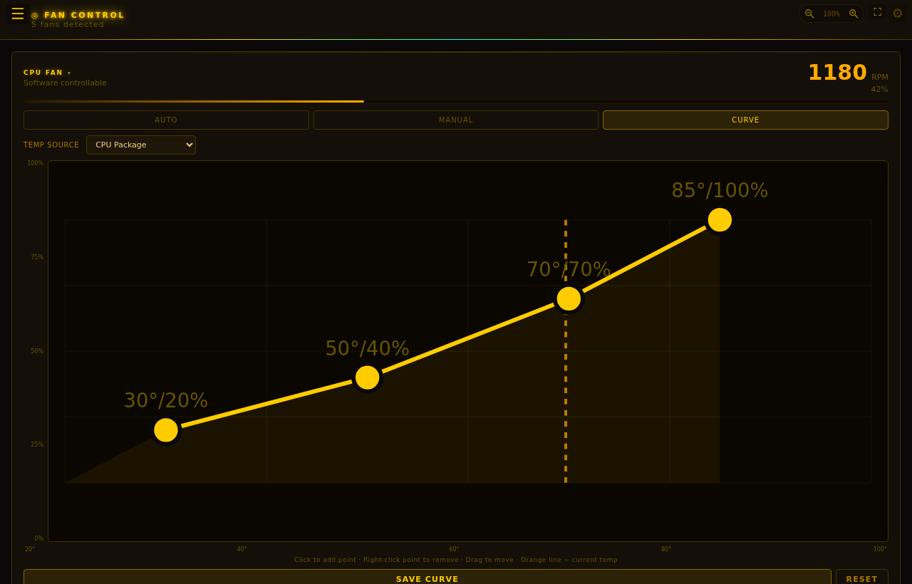 | 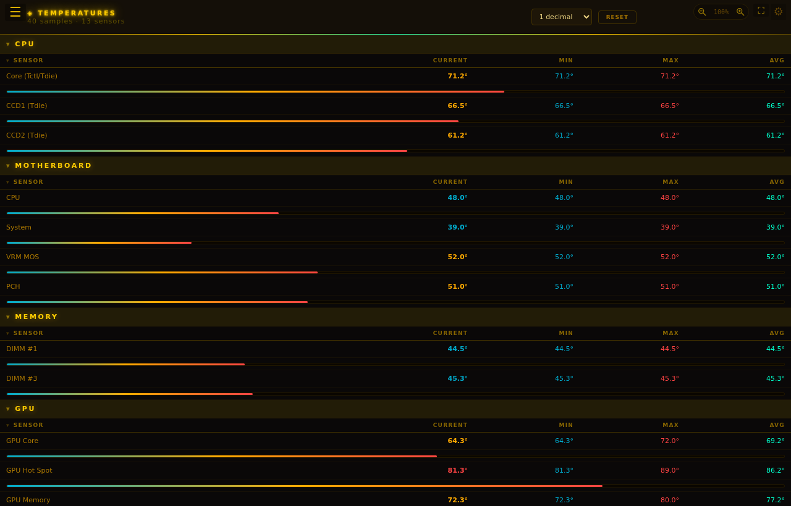 |
| **Auto / manual / curve for motherboard and GPU fans** | **Every sensor with current, min, max and average** |

| RGB Control | CSV Recording |
|---|---|
| 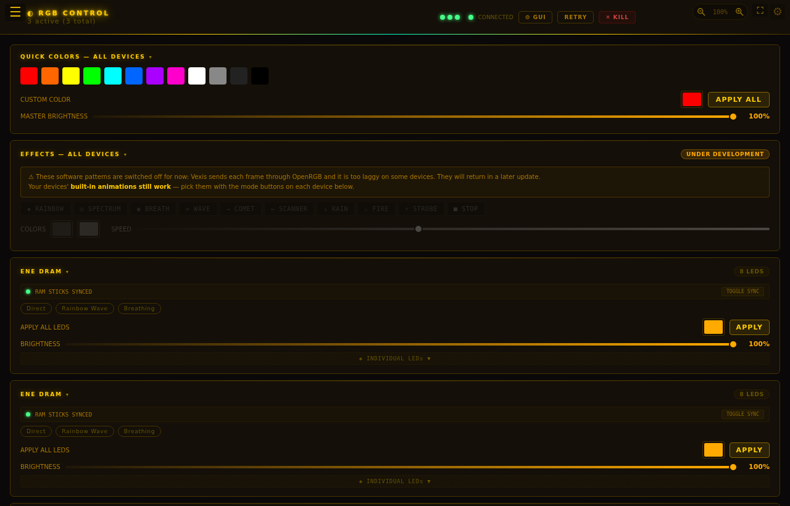 | 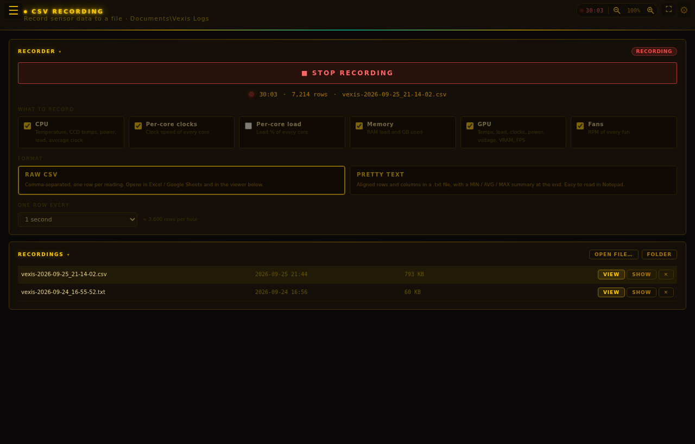 |
| **OpenRGB devices, brightness, hardware modes** | **Record what you choose; built-in viewer with charts** |

| Settings | Memory |
|---|---|
| 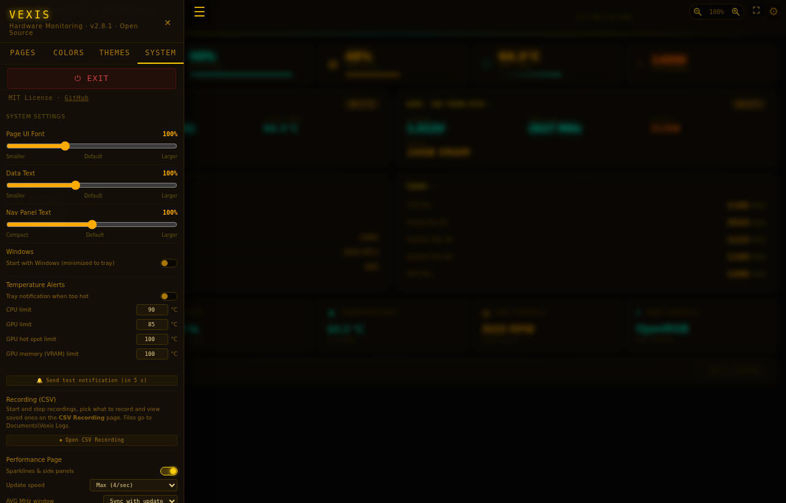 | 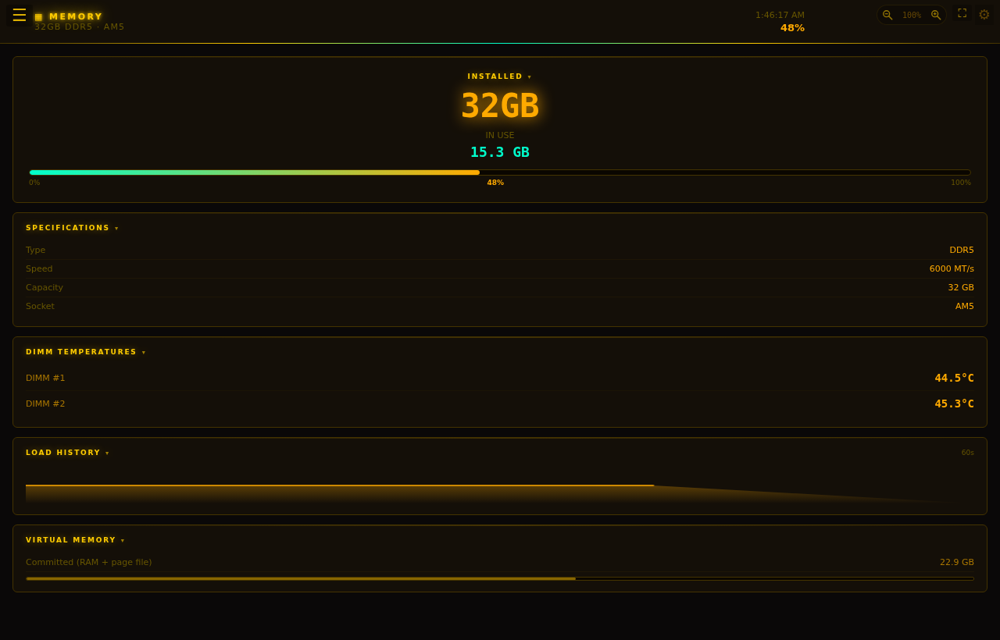 |
| **Text scaling, alerts, start with Windows, themes** | **Usage, DIMM temperatures, history** |

---

## Features

### Monitoring
| | |
|---|---|
| **CPU** | Per-core clocks, threads in use per core (adjustable busy threshold), temperatures, CCD temps and V-Cache / Compute groups on Ryzen, P- and E-cores on Intel, package power |
| **Thread Viewer** | Every core and hardware thread: live thread map, labelled activity timeline, sortable core table with session peaks and averages |
| **GPU** | Load (core, memory controller, video engine, bus, power limit), core / hot-spot / memory temperatures, clocks, power, VRAM, fans, PCIe traffic, FPS, history charts and every raw sensor |
| **Memory** | RAM and virtual memory usage, DDR5 DIMM temperatures, load history |
| **Temperatures** | Every thermal sensor grouped by component, with min / max / average |
| **Processes** | Grouped by app with icons; CPU, memory and GPU per process; search, sort, pause, End task (Windows-critical processes are protected) |

### Control
| | |
|---|---|
| **Fan Control** | Auto / Manual / Curve for motherboard and GPU fans (NVIDIA & AMD). Curves can follow CPU, CCD, GPU core, GPU hot spot or VRAM temperature. GPU fans are forced to 100% if the GPU overheats, and every fan goes back to BIOS / driver control when Vexis closes. Health check per fan. |
| **RGB Control** | OpenRGB integration: quick colours for all devices, master and per-device brightness, hardware modes (rainbow, breathing…), per-LED painting, RAM stick sync |

### Tools
| | |
|---|---|
| **Temperature Alerts** | Tray notification when CPU, GPU, GPU hot spot or VRAM passes your limit. The tray icon blinks and the app lists what triggered until you clear it. |
| **CSV Recording** | Choose what to record, raw CSV (Excel / Sheets) or pretty aligned text with a summary, and the row interval. Built-in viewer with summary, chart and table. Rows are written as they happen, so a log survives a crash. |
| **Driver Check** | Every launch: repairs the PawnIO sensor driver if needed and reports a missing graphics driver or devices with driver problems |
| **One-click Updates** | New release on GitHub → **Update now** downloads, installs and restarts Vexis |

### Comfort
| | |
|---|---|
| **Themes** | 8 presets plus full per-colour editing and 3 saved profiles |
| **Scaling** | Separate sliders for page text, data values and the navigation panel, plus zoom buttons |
| **Pop-out windows** | Open any page in its own window — great for a second monitor |
| **Start with Windows** | Starts minimized to the tray at sign-in, no UAC prompt |
| **Remembers you** | Window size and position, collapsed sections, settings |

---

## Installation

1. Download **`VexisHM-Setup.exe`** from the [latest release](https://github.com/Vlottiz/Vexis-PC-monitor-and-controll/releases/latest).
2. Run it and click through the installer.
3. Start Vexis from the Desktop or Start Menu. It asks for administrator rights — these are needed to read hardware sensors.

The installer:
- installs Vexis to `C:\Program Files\Vexis` with Desktop and Start Menu shortcuts,
- installs the **PawnIO** sensor driver if it is missing,
- installs the **Microsoft WebView2 Runtime** on Windows 10 if it is missing (needs internet once),
- adds Vexis to *Apps & features* for a clean uninstall.

> **"Windows protected your PC"?** Vexis isn't code-signed yet, so SmartScreen warns about new downloads. Click **More info → Run anyway**.

### Updating

Vexis checks GitHub for a new release when it starts. When one is out, an **UPDATE** badge appears at the top right — click it, then **Update now**. Your settings are kept.

---

## Requirements

- **Windows 10 or 11, 64-bit** — Intel or AMD processor
- **Administrator rights** (Vexis asks when it starts)
- Nothing else — the .NET runtime is bundled, WebView2 and PawnIO come with the installer
- **For RGB:** [OpenRGB](https://openrgb.org) installed

### Compatibility

| | Supported | Notes |
|---|---|---|
| **Intel CPUs** | Temperatures, per-core clocks, load, threads, power | 12th gen+ P-cores and E-cores shown separately |
| **AMD Ryzen** | Tctl/Tdie, CCD temps, per-core clocks, load, threads, power | Dual-CCD X3D parts show V-Cache and Compute groups |
| **GPUs** | NVIDIA, AMD, Intel Arc | Fan control on NVIDIA and AMD |
| **Motherboards** | Most ASUS, MSI, Gigabyte and ASRock boards | Fans and board sensors depend on [LibreHardwareMonitor](https://github.com/LibreHardwareMonitor/LibreHardwareMonitor) support for the board's sensor chip |
| **RAM** | Usage, DDR5 DIMM temperatures | DIMM temperatures need sticks with a thermal sensor |

Not supported: Windows on ARM, Windows 7 / 8.1, 32-bit Windows, Linux and macOS.

---

## Troubleshooting

| Problem | Fix |
|---|---|
| **Fans missing** | MSI Center, Armoury Crate, HWiNFO, AIDA64 and similar apps lock the fan chip. Close them and restart Vexis. |
| **No per-core data** | Open **Security → Install / Repair PawnIO**, then restart Vexis. |
| **A game's anti-cheat complains** | Some anti-cheat systems restrict hardware-monitoring drivers. Close Vexis while playing that game. |
| **Antivirus flags the download** | New, unsigned hardware tools sometimes trigger machine-learning detections. The source is here to inspect. |
| **Something else** | The log is at `%AppData%\Vexis\debug.log`, and live on the **Security** page. Please attach it to an [issue](https://github.com/Vlottiz/Vexis-PC-monitor-and-controll/issues). |

### About the sensor driver

Vexis reads sensors through [PawnIO](https://pawnio.eu), the signed driver used by LibreHardwareMonitor. It works with **Memory Integrity, VBS and the Vulnerable Driver Blocklist left on** — Vexis does not change any Windows security settings. (Very early Vexis builds did; if you used one, open **Security → Restore Windows Protections** and restart.)

### Privacy

Vexis has no telemetry and no accounts. The only internet access is checking and downloading releases from this GitHub repository. Everything else stays on your PC.

---

## Building from source

Prerequisites: [.NET 8 SDK](https://dotnet.microsoft.com/download) and [NSIS](https://nsis.sourceforge.io/Download) (for the installer).

```powershell
git clone https://github.com/Vlottiz/Vexis-PC-monitor-and-controll.git
cd Vexis-PC-monitor-and-controll
dotnet run          # run from an administrator terminal
```

### Making a release

1. Set `<Version>` in `Pcmonitor2_0.csproj` (e.g. `2.8.1`) — the app, the installer and the update check all read it.
2. Run **`build-installer.bat`**. It downloads PawnIO and WebView2 if needed, publishes the app and builds **`VexisHM-Setup.exe`**.
3. On GitHub: **Releases → Draft a new release**, tag **`v2.8.1`** (a `v` plus the exact version), attach `VexisHM-Setup.exe`, publish. Don't mark it as a pre-release.

> The tag must match the version. Installed copies compare the tag with their own version — a tag like `1.0.1` or `Vexis` is never seen as an update.

### Customising

- **Loading screen:** replace `splash.gif` (440 × 220 px works best) — see `SplashForm.cs`, or edit and run `assets/make_splash.py`.
- **Screenshots:** the images in `docs/screenshots/` are shown on this page. To use your own, take a screenshot of a Vexis page (`Win + Shift + S`), save it with the same file name (e.g. `gpu.png`), and replace the file on GitHub (**Add file → Upload files** into `docs/screenshots`).

---

## Credits & Attributions

| Project | Use | License |
|---|---|---|
| [LibreHardwareMonitor](https://github.com/LibreHardwareMonitor/LibreHardwareMonitor) | All hardware sensor reading | MIT |
| [PawnIO](https://pawnio.eu) | Signed sensor driver (installed unmodified) | — |
| [OpenRGB](https://gitlab.com/CalcProgrammer1/OpenRGB) | RGB device control (external, not bundled) | GPL-2.0 |
| [HIDAPI](https://github.com/libusb/hidapi) | HID device communication | MIT/BSD |
| [Microsoft WebView2](https://developer.microsoft.com/en-us/microsoft-edge/webview2/) | Embedded browser for the UI | Free |
| [System.Management](https://www.nuget.org/packages/System.Management) | WMI — CPU load, RAM, Intel fallback | MIT |
| [NSIS](https://nsis.sourceforge.io) | Windows installer | zLib |
| [Claude — Anthropic](https://claude.ai) | AI assistant for accelerating development | — |

All ideas, feature design, and project direction by **[Vlottiz](https://github.com/Vlottiz)**.  
Claude assisted with implementation speed, debugging, and boilerplate. Every feature was conceived and directed by the author.

---

## Support

If Vexis is useful to you, you can support development:

[](https://buymeacoffee.com/reyobu)

Found a bug or have an idea? [Open an issue](https://github.com/Vlottiz/Vexis-PC-monitor-and-controll/issues).

## License

MIT — see [LICENSE.txt](LICENSE.txt). Bundled and linked components keep their own licenses (see Credits).
